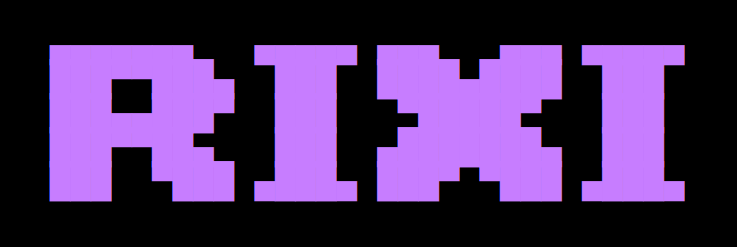

<p align="center">



<br>

**Stop copying. Start RIXI.**

<br/>

[](https://github.com/rixi-dev/rixi/releases) [](LICENSE) [](https://www.rust-lang.org/) []()

</p>

---

## What is RIXI?

You found a beautiful desktop on r/unixporn. You clone the repo. You spend the next hour figuring out where configs go, what fonts they used, why polybar won't start, and why your terminal looks nothing like theirs.

**RIXI fixes that.**

RIXI is a terminal-first, component-based Linux rice manager built in Rust. It lets you package, apply, switch, and roll back desktop configurations (called *rices*) in a single command. No shell scripts. No manual config copying. No guessing.

```bash
rixi apply sathiya/gruvbox
```

Your desktop transforms. Instantly.

> **RIXI is v0.2** — local + community workflows are live. Pull themes from `rixi-dev/themes` and push your own with a PR in one command flow.

---

<p align="center">

</p>

---

## Commands

```bash
rixi init        # scaffold a manifest from your current setup
rixi apply       # snapshot, copy configs, reload, done
rixi rollback    # something broke? go back instantly
rixi list        # see what's installed locally
rixi pull        # download a rice from rixi-dev/themes
rixi push        # submit your local rice as a GitHub PR
```

**`rixi init`** scans your system, detects installed components, asks five questions, and packages your rice into a clean structured directory. Done in 30 seconds.

**`rixi apply <author/theme>`** snapshots your current state first, then copies configs to the right places using the built-in component registry. No paths needed in the manifest.

**`rixi rollback`** reverts to the last snapshot instantly. One command. No drama.

**`rixi list`** shows everything installed locally with `[current]` marked.

**`rixi pull <author/theme>`** downloads a rice from the community registry into your local store.

**`rixi push <author/theme>`** validates your local rice, authenticates with GitHub, uploads files to your fork, and opens a PR against `rixi-dev/themes`.

---

## Features

- **Distro-aware dependency warnings.** Missing `bspwm`? RIXI prints the exact `pacman`/`apt`/`dnf` command to install it.
- **Built-in component registry.** RIXI ships knowing where supported tools' config files live on your system.
- **Wallpaper handling.** feh, nitrogen, hyprpaper, swww, swaybg — RIXI sets it automatically.
- **Timestamped snapshots.** Every apply creates a snapshot of your previous state. Rollback is always one command away.

---

## Rice structure

Every RIXI rice follows a single, predictable layout:

```
~/.local/share/rixi/store/
  sathiya/
    gruvbox/
      manifest.toml       ← the source of truth
      configs/
        bspwm/
          bspwmrc
        polybar/
          config
        rofi/
          config.rasi
        alacritty/
          alacritty.toml
        picom/
          picom.conf
      walls/
        gruvbox.png
      preview.png
```

---

## The manifest

```toml
[meta]
name = "gruvbox"
author = "sathiya"
version = "0.1.0"
wm = "bspwm"
display_server = ["x11"]
colorscheme = "gruvbox"
components = ["bspwm", "polybar", "rofi", "alacritty", "picom"]
tags = ["minimal", "dark", "gruvbox"]
description = "minimal gruvbox bspwm setup"

[dependencies]
packages = ["bspwm", "sxhkd", "polybar", "rofi", "alacritty", "picom", "feh"]
fonts = ["JetBrainsMono Nerd Font"]
icons = ["Papirus"]

[wallpaper]
file = "walls/gruvbox.png"
setter = "feh"
```

No file paths. No custom mappings. RIXI ships with a built-in registry that knows where every component's config lives.

---

## Supported components

| Category | Components |
|---|---|
| WM (X11) | bspwm, i3, openbox, awesome, herbstluftwm |
| WM / Compositor (Wayland) | hyprland, sway, niri, river |
| Bars | polybar, waybar, eww |
| Launchers | rofi, wofi, tofi, fuzzel |
| Terminals | alacritty, kitty, wezterm, foot |
| Notifications | dunst, mako, swaync |
| Compositor (X11) | picom |
| Wallpaper setters | feh, nitrogen, hyprpaper, swww, swaybg |
| Lock screens | i3lock, swaylock, hyprlock |
| Keybindings | sxhkd |

Missing something? [Open a PR](https://github.com/rixi-dev/rixi) to add it to the registry.

---

## Installation

### cargo
```bash
cargo install rixi
```

### Build from source
```bash
git clone https://github.com/rixi-dev/rixi
cd rixi
cargo build --release
chmod +x target/release/rixi
sudo cp target/release/rixi /usr/local/bin/
```

---

## Roadmap

- [x] **v0.1** — Local rice manager: init, apply, rollback, list. Built-in component registry, dependency detection, wallpaper handling.
- [x] **v0.2** — Community registry via `rixi-dev/themes`. Pull and push rices directly from the terminal.
- [ ] **v0.3** — TUI browser, search, ratings, and an improved shell-integration design.

---

## Contributing

RIXI is early and moving fast. Issues, PRs, and feedback are all welcome.

To submit a theme, use `rixi push <author/theme>`. See [CONTRIBUTING.md](CONTRIBUTING.md) for everything else.

---

## License

[MIT](LICENSE).
